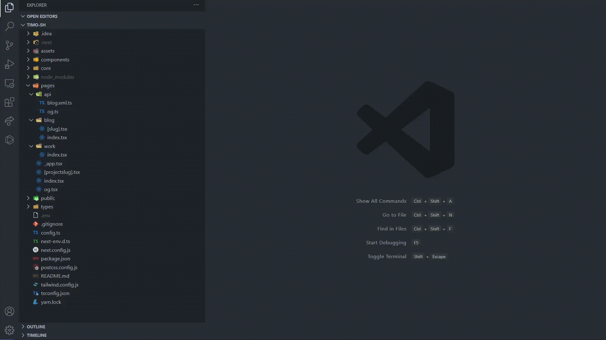

# VSCode Router Explorer

This extension helps navigate in file-system based router projects easily.

It's useful if you are using frameworks like Next.js or Nuxt.js.

## The problem it solves

When using regular file search in VSCode, it's inconvenient to navigate to the right page based on URL. Most of the
time, you have an API endpoint or web URL, and you want to navigate to its source code. So you have to figure it out by
yourself by looking at your `pages` directory, and open navigate directory after directory - to find the right place in
the file system. We can't infer the right file from the URL without searching in the file system. Meaning that based on
the url, I can create more than one file-system structure that match that url. Tryings like writing the end of the route
may not search the result you want - it can be a parameterized id or non-unique. Most of the time directories are
usually parameterized (like `[slug]`) and the files are called `index` or parameterized too (`[id].tsx`). This extension
helps you navigate to the source file. Just paste the URL or path - and it will navigate to the right file for you.

## How to use

- Enter `router explorer` in the command palette.
  > Examples: /api/v2/user/1, localhost:3000/url, github.com/nirtamir2, https://nirtamir.com/blog
- Write the url you want to navigate to and press enter.
- You will be navigated to the matching page component that matches the url (or get an error if the route is not found)

## Extension Settings

`router-explorer.root.directory.name`:
Specify the root directory to search for routes.

`router-explorer.search.routes.vue.pattern`:
Specify which patters it should search for vue files

- Next style - files are organized like `[id].vue` `[...fallback].vue` (
  like https://github.com/hannoeru/vite-plugin-pages)
- Nuxt style - files are organized like `_id.vue` `_.vue` (
  like https://nuxtjs.org/docs/features/file-system-routing#dynamic-pages). This is the default

## Demo

